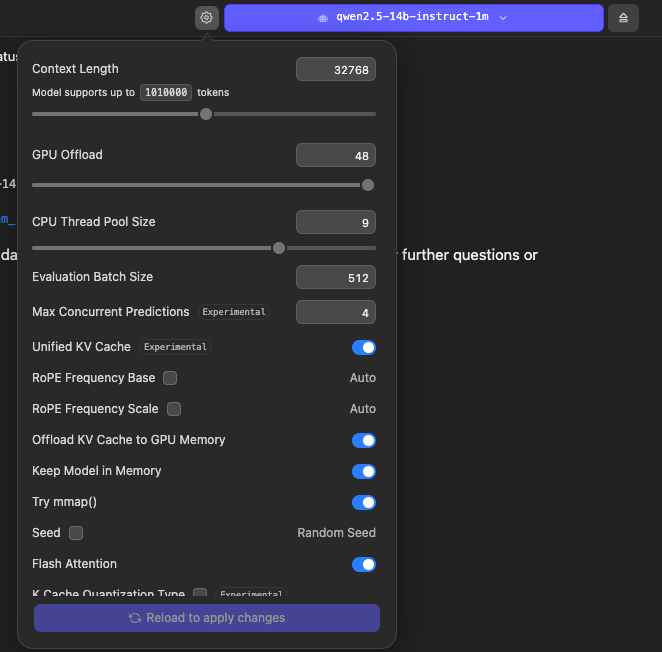

# panda-mcp-client

PanDA MCP client tools for Claude Desktop, LM Studio, and similar LLM clients.

> **Disclaimer:** This is a proof-of-concept. No production-level support is provided at this time.
>
> The MCP server runs inside the CERN network. You must be on the CERN network or connected via a tunnel such as [eduVPN](https://eduvpn.docs.cern.ch/) (or your preferred tunneling mechanism) for the proxy to reach it.

## Tools

| Command | Purpose |
|---|---|
| `get-panda-token` | Device-flow OIDC login — run once to obtain and cache a token |
| `panda-mcp-proxy` | stdio↔HTTPS/SSE proxy with automatic token refresh |

## Requirements

- Python 3.10+
- [uv](https://docs.astral.sh/uv/) (recommended) or pip

## Quick start

### 0. Install uv

Follow the [official installation instructions](https://docs.astral.sh/uv/getting-started/installation/).

### 1. Get a token

```bash
uvx --from panda-mcp-client get-panda-token
```

Follow the browser prompt. The token is saved to `~/.panda_id_token`.

> **Re-run this command roughly once a month.** The proxy refreshes the short-lived id\_token
> automatically, but it relies on a refresh token that expires after ~1 month. Once the refresh
> token expires the MCP connection will silently stop working — error messages are only visible
> in the Claude Desktop logs, not in the chat interface.

### 2. Configure your LLM client

**Claude Desktop**

| Platform | Config file |
|---|---|
| macOS | `~/Library/Application Support/Claude/claude_desktop_config.json` |
| Windows | `%APPDATA%\Claude\claude_desktop_config.json` |
| Linux | `~/.config/Claude/claude_desktop_config.json` |

```json
{
  "mcpServers": {
    "panda-mcp": {
      "command": "uvx",
      "args": ["--from", "panda-mcp-client", "panda-mcp-proxy"]
    }
  }
}
```

**LM Studio**

| Platform | Config file |
|---|---|
| macOS / Linux | `~/.lmstudio/mcp.json` |
| Windows | `%USERPROFILE%\.lmstudio\mcp.json` |

```json
{
  "mcpServers": {
    "panda-mcp": {
      "command": "uvx",
      "args": ["--from", "panda-mcp-client", "panda-mcp-proxy"]
    }
  }
}
```

For LM Studio, model and context length settings matter. The screenshot below shows a working configuration. Note that smaller context lengths can be insufficient for MCP responses from PanDA. Other values (e.g. GPU layers, memory settings) are specific to the hardware used and may need to be adjusted for your machine.


## Environment variables

All variables are optional; the defaults match those of `panda_mcp_wrapper.sh`.

| Variable | Default | Description |
|---|---|---|
| `PANDA_SERVER` | `https://pandaserver.cern.ch:25443` | PanDA server URL |
| `VO` | `atlas` | Virtual organisation |
| `TOKEN_FILE` | `~/.panda_id_token` | Token cache file |
| `MCP_URL` | `https://aipanda120.cern.ch:8443/mcp/` | Remote MCP server URL |
| `SSL_CERT_FILE` | — | Path to CA bundle (custom CAs) |
| `REQUESTS_CA_BUNDLE` | — | Alternative to `SSL_CERT_FILE` |

The CERN MCP server uses a certificate that is not in the default system trust store.
You must provide a CA bundle via `SSL_CERT_FILE`, otherwise the connection will be rejected.

To build the bundle, download the CERN CA certificates and merge them with your system's existing CAs:

```bash
curl -o cern-root-ca.crt https://ca.cern.ch/cafiles/certificates/CERN%20Root%20Certification%20Authority%202.crt
openssl x509 -inform DER -in cern-root-ca.crt -out cern-root-ca.pem
curl -o cern-grid-ca.pem https://ca.cern.ch/cafiles/certificates/CERN%20Grid%20Certification%20Authority\(1\).crt
cat $(python3 -c "import certifi; print(certifi.where())") cern-root-ca.pem cern-grid-ca.pem > ~/all-certs.pem
````

```bash
# If you want to test that the bundle works, you can run the below. The warnings below are expected, but you should not see any SSL errors.
export SSL_CERT_FILE=~/all-certs.pem
uvx --system-certs --from panda-mcp-client panda-mcp-proxy
2026-06-05 16:37:01,482 [panda_mcp_proxy] WARNING Opening server-push SSE channel to https://aipanda120.cern.ch:8443/mcp/
2026-06-05 16:37:01,583 [panda_mcp_proxy] WARNING Server does not support GET SSE push (400) — skipping.
```

Then point `SSL_CERT_FILE` at the resulting file. Example LLM client configuration:

```json
{
  "mcpServers": {
    "aipanda120-mcp": {
      "command": "uvx",
      "args": ["--from", "panda-mcp-client", "panda-mcp-proxy"],
      "env": {
        "SSL_CERT_FILE": "/path/to/your/ca-bundle.pem"
      }
    }
  }
}
```

## Token refresh

`panda-mcp-proxy` refreshes the token automatically using the `refresh_token` stored
in `~/.panda_id_token`. Refresh happens 5 minutes before expiry. If the refresh token
is also expired, re-run `get-panda-token`.